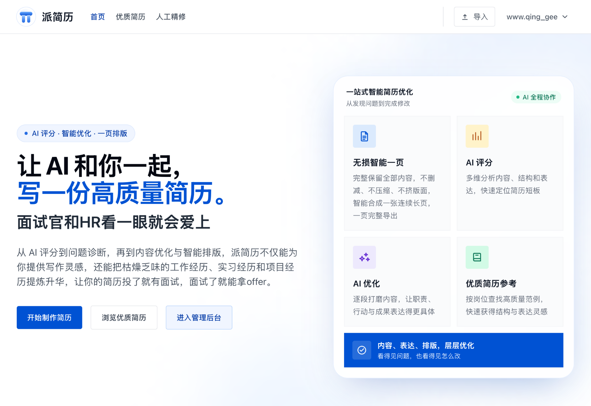
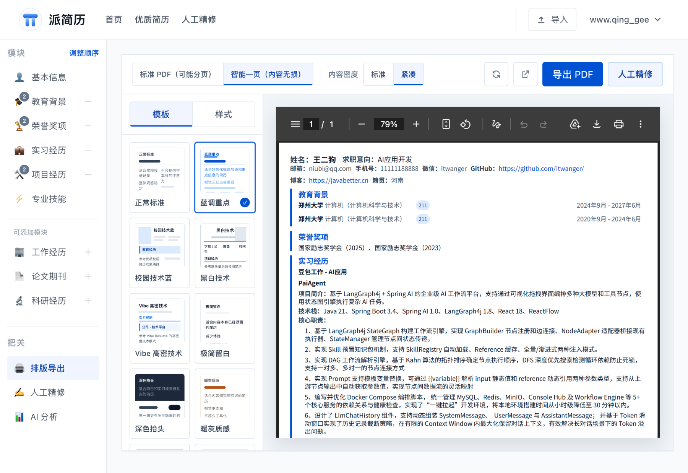

<div align="center">

# 📄 PaiResume · 派简历

**让 AI 和你一起，写一份高质量简历**

[](LICENSE)
[](https://react.dev/)
[](https://spring.io/projects/spring-boot)
[](#贡献)

[在线体验](https://resume.paicoding.com) · [产品文档](https://resume.paicoding.com) · [报告 Bug](https://github.com/itwanger/PaiResume/issues)

</div>

---

## ✨ 产品简介

**派简历**（[resume.paicoding.com](https://resume.paicoding.com)）是一款面向中文求职者的在线智能简历编辑器。从 AI 评分到问题诊断，再到内容优化与智能排版，派简历不仅能为你提供写作灵感，还能把枯燥乏味的工作经历、实习经历和项目经历提炼升华，让你的简历投了就有面试，面试了就能拿 offer。

> 🎯 **面试官和 HR 看一眼就会爱上**

## 🖼️ 产品截图

<div align="center">



*首页 — AI 评分 · 智能优化 · 一页排版，一站式智能简历优化*

</div>

---

## 🌟 核心卖点

### 🤖 AI 智能优化

看得见问题，也看得见怎么改。派简历的 AI 能力覆盖**评分、诊断、优化**全流程：

| 功能 | 说明 |
|------|------|
| **AI 评分** | 多维分析内容、结构和表达，快速定位简历短板 |
| **AI 优化** | 逐段打磨内容，让职责、行动与成果表达得更具体 |
| **单模块优化** | 对实习经历、项目经历等模块整体优化 |
| **单字段优化** | 对项目简介、核心职责等字段逐句打磨 |
| **自定义提示词** | 支持自定义分析提示词，满足个性化需求 |

> 💡 AI 优化不是简单替换文字，而是帮你把"做了什么"升级为"做成了什么"——用**职责、行动、成果**的结构让每段经历都更有说服力。

### 📄 无损智能一页

完整保留全部内容，不删减、不压缩、不挤版面，智能合成一张连续长页，一页完整导出。

| 传统一页简历 | 派简历无损智能一页 |
|-------------|-------------------|
| 删减内容，忍痛割爱 | ✅ **完整保留全部内容**，不删减 |
| 缩小字体，阅读困难 | ✅ **不压缩字号**，保持最佳可读性 |
| 挤压版面，拥挤杂乱 | ✅ **不挤版面**，留白合理、层次清晰 |
| 多页 PDF，翻阅不便 | ✅ **智能合成一张连续长页**，一页完整导出 |

<div align="center">



*实际效果 — 所有内容完整保留在 1 页内，PDF 显示 "1 / 1" 页*

</div>

> 🎯 **无损智能一页对所有用户免费开放！** 文件完全在浏览器本地生成并下载，不上传服务器，保护你的隐私。

---

## 🚀 功能亮点

- 📝 **模块化编辑** — 基础信息、教育背景、实习经历、项目经历、专业技能、论文发表、科研经历、获奖情况 9 大模块
- 👁️ **实时预览** — 左侧导航、中间编辑、右侧预览，所见即所得
- 📥 **多格式导入** — 支持拖拽导入 Markdown / TXT 格式的结构化简历
- 📤 **PDF 导出** — 所有用户均可在浏览器本地导出标准 PDF
- 🎨 **多套排版** — 内置"校园技术蓝"等多套推荐排版
- 📚 **优质简历库** — 按岗位查找高质量范例，快速获得结构与表达灵感
- 🏪 **简历市场** — 用户可发布免费或付费简历，创作者可获得收益
- 🔒 **隐私保护** — PDF 导出完全在浏览器本地完成，不上传服务器

---

## 💻 技术栈

### 前端

- **React 18** + **TypeScript**
- **Vite 6** 构建工具
- **React Router 7** 路由
- **Zustand** 状态管理
- **Tailwind CSS** 样式框架
- **Framer Motion** 动画
- **@react-pdf/renderer** PDF 生成

### 后端

- **Java 17** + **Spring Boot 3.3**
- **Spring Security** 安全框架
- **MyBatis-Plus** ORM
- **MySQL 8.x** 数据库
- **Redis** 缓存
- **阿里云 OSS** 对象存储
- **JWT** 认证
- **Knife4j / OpenAPI** 接口文档

---

## 🛠️ 快速开始

### 环境要求

- Node.js 18+
- npm 9+
- Java 17
- Maven 3.9+
- MySQL 8.x
- Redis 6.x 或 7.x

### 1. 克隆项目

```bash
git clone https://github.com/itwanger/PaiResume.git
cd PaiResume
```

### 2. 配置环境变量

```bash
cp .env.example .env
```

按实际情况修改 `.env`，至少确认以下配置：

- `MYSQL_HOST` / `MYSQL_PORT` / `MYSQL_DATABASE` / `MYSQL_USERNAME` / `MYSQL_PASSWORD`
- `REDIS_HOST` / `REDIS_PORT`
- `JWT_SECRET`
- `AI_API_KEY` / `AI_BASE_URL` / `AI_MODEL`

### 3. 启动后端

```bash
cd server
mvn spring-boot:run
```

后端默认地址：`http://localhost:8084/api`

### 4. 启动前端

```bash
npm install
npm run dev
```

前端默认地址：`http://localhost:5173`

### 5. 登录测试

开发环境自动创建测试账号：

| 角色 | 邮箱 | 密码 |
|------|------|------|
| 普通用户 | `test@example.com` | `Test123456` |
| 管理员 | `admin@example.com` | `Admin123456` |

---

## 📖 更多文档

- [部署指南](deploy/README.md) — 三阶段开关、发布顺序、回滚与生产预检
- [环境变量说明](.env.example) — 完整的环境变量配置说明
- [开发建议](#开发建议) — 常见问题排查

### 开发建议

- 建议先启动 MySQL 和 Redis，再启动后端，最后启动前端
- 如果前端请求异常，先确认 `VITE_API_PROXY_TARGET` 与后端端口是否一致
- 如果 AI 分析失败，优先检查后端 `AI_API_KEY`、`AI_BASE_URL`、`AI_MODEL`
- 如果 PDF 导出异常，确认 `public/fonts/` 下的字体文件存在

---

## 🤝 贡献

欢迎提交 Issue 和 Pull Request！

1. Fork 本仓库
2. 创建你的特性分支 (`git checkout -b feature/AmazingFeature`)
3. 提交你的改动 (`git commit -m 'Add some AmazingFeature'`)
4. 推送到分支 (`git push origin feature/AmazingFeature`)
5. 开启一个 Pull Request

---

## 📄 许可证

本项目采用 MIT 许可证 — 查看 [LICENSE](LICENSE) 文件了解详情。

---

<div align="center">

**[在线体验](https://resume.paicoding.com)** · **[GitHub](https://github.com/itwanger/PaiResume)** · **[Issues](https://github.com/itwanger/PaiResume/issues)**

© 2026 PaiResume · 让 AI 和你一起，写一份高质量简历

</div>
